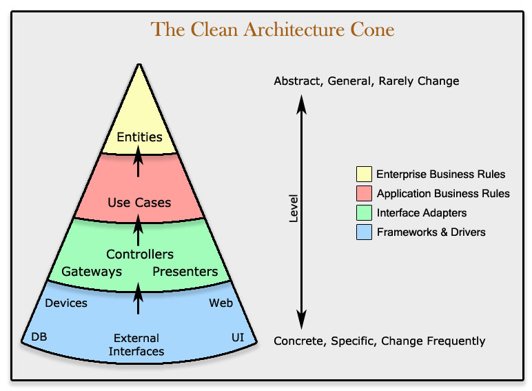

# Clean Architecture Skeleton
  
> The center of your application is not the database. Nor is it one or more of the frameworks you may be using. **The center of your application is the use cases of your application**  -  _Unclebob_ ([source](https://blog.8thlight.com/uncle-bob/2012/05/15/NODB.html "NODB"))  
  
## Project structure
```
- src
    - Domain
        - Entity
    - Infrastructure
    - Presentation
    - Repository
    - UseCase
```

- Domain
    - Represents db skeleton (via entity)
- Infrastructure
    - Core interfaces for all repositories
- Presentation
    - User Experience (Can be an api, cli app, etc)
- Repository
    - Database/service operations 
- UseCase
    - Execute specific business logic


